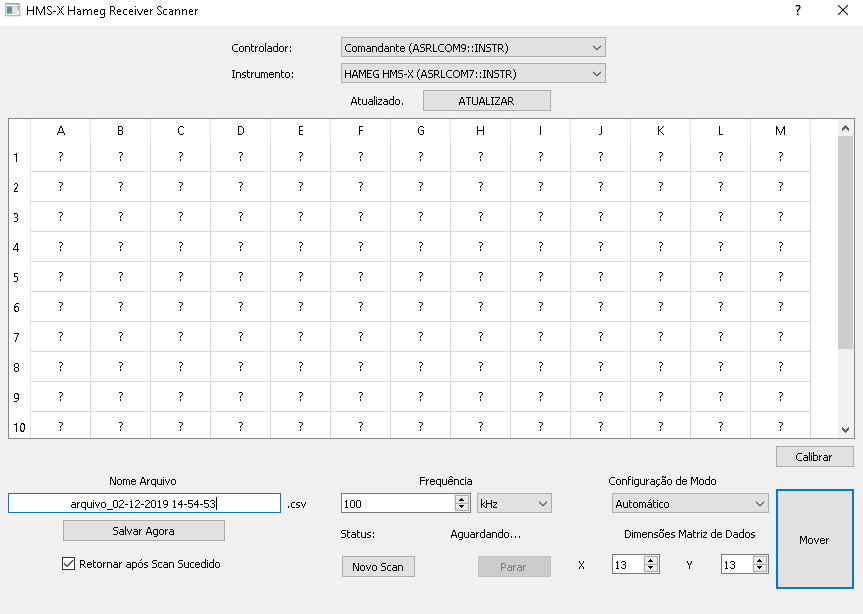
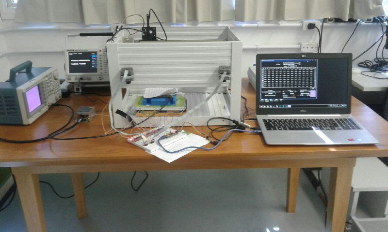

# SCPI Interface for HMS-X HAMEG

The purpose of this interface is to make a specific type of measurement operation easier with the aid of automation and a graphical interface utilizing 

- PyVISA
- PySide
- EasyDriver V44 A3967 + Step Motors
- STM32F103C8T6 ("Bluepill" Schematic)

## Images

#### User Interface

#### System + HAMEG HMS-X Spectrum Analyzer 

More details to come.